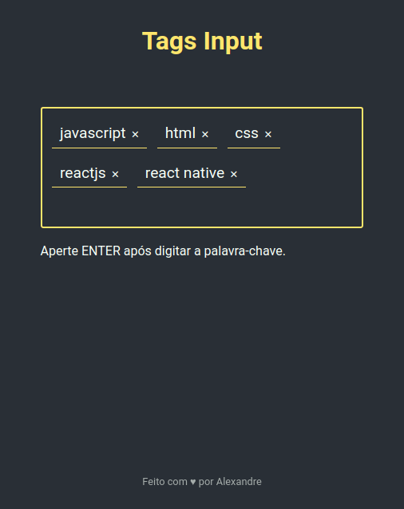

<h1 align="center">
  Tags Input
  <br />
  <a href="https://www.linkedin.com/in/alexandre-costa-401699199">
    
  </a>
  <br />
  <a href="https://github.com/alexandredev3/proffy/issues">
    
  </a>
  <a href="https://github.com/alexandredev3/proffy/network">
    
  </a>
  <a href="https://github.com/alexandredev3/proffy/stargazers">
    
  </a>
</h1>
<p align="center">
 <a href="#description">Descrição</a> •
 <a href="#design">Design</a> • 
 <a href="#features">Funcionalidades</a> • 
 <a href="#tecnologias">Tecnologias</a> •
 <a href="#install">Instalação</a> •
 <a href="#author">Autor</a> •
</p>
<p align="center" id="description">
  Site para adicionar tags.
</p>
<h1 align="center" id="design">
  
</h1>

<h2 id="features">
  📑️ Features
</h2>

- [x] Adicionar Tags.
- [x] Remover Tags.
- [x] Separar tags através de vírgulas.

<h2 id="tecnologias">
  🛠 Tecnologias
</h2>

 As seguintes ferramentas foram usadas na construção do projeto:

- [Html]()
- [Css]()
- [Javascript]()

<h2 id="install">
   📜️ Instalação
</h2>

### Pré-requisitos

Antes de começar, você vai precisar ter instalado em sua máquina o [Git](https://git-scm.com).
Além disto é bom ter um editor para trabalhar com o código como 
[VSCode](https://code.visualstudio.com/), [SublimeText](https://www.sublimetext.com/) ou [Atom](https://atom.io/).


### 👨‍💻️ Clonando repositório.

```bash
$ git clone <git@github.com:alexandredev3/tags-input.git>

# Vá para a pasta tagsinput
$ cd tagsinput

# Agora abra o arquivo index.html no seu browser.
```

<h2 id="author">
   👷️ Autor
</h2>

<a href="https://github.com/alexandredev3/">
 
 <br />
 <sub><b>Alexandre Costa</b></sub>
</a>


Feito com ❤️ por Alexandre Costa 👋🏽 Entre em contato!🚀

<a href="https://www.linkedin.com/in/alexandre-costa-401699199">
  
</a>
